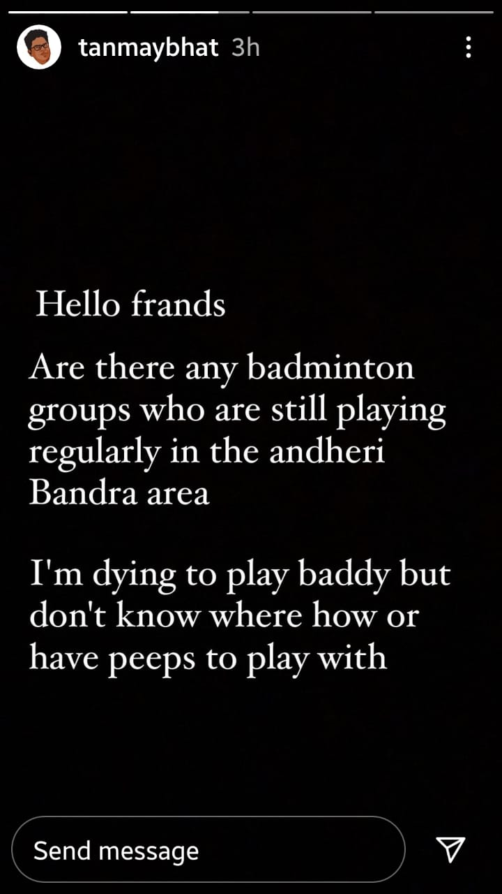

<p align="center"></p>
<h1 align="center">Welcome to Runbhumi 👋</h1>
<p align="center">
  <a href="../Runbhumi/documentation/auth.md" target="_blank">
    
  </a>
  
  
  <a href="https://github.com/Runbhumi/Runbhumi/blob/master/LICENSE" target="_blank">
    
  </a>
  
    
</p>

> A Flutter app which aims to build a sports community

### 🏠 [Homepage](https://runbhumi-website.vercel.app)

### ✨ [Prototype](https://www.figma.com/proto/LB4Ovc0vF92Q0twfrBacfa/Runbhumi?node-id=3%3A198&viewport=-537%2C287%2C0.35181379318237305&scaling=scale-down)

### 💪 Motivation/Inspiration




## 📥 Install

```sh
flutter pub get
```

## 👷‍♂️ Usage

```sh
flutter run
```

## ✨ Format code

```sh
flutter format .
```

## 🧪 Test

```sh
flutter analyze .
flutter test
```
  
</details>

## Author

🏢 **Runbhumi**

- Github: [@Runbhumi](https://github.com/Runbhumi)


## 🤝 Contributing

issues and feature requests are welcome!<br />Feel free to check [issues page](https://github.com/Runbhumi/Runbhumi/issues), the [contribution guidelines](CONTRIBUTING.md) and [Code of Conduct](CODE_OF_CONDUCT.md)

## Show your support 

Give a ⭐️ if this project helped/inspired you!

## 📝 License

Copyright © 2020 [Runbhumi](https://github.com/Runbhumi).<br />
This project is [MIT](https://github.com/Runbhumi/Runbhumi/blob/master/LICENSE) licensed.
